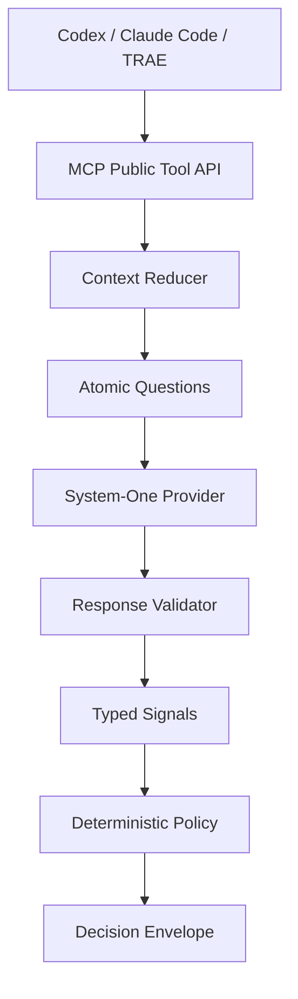

# Decision Kernel 架构

## 定位

`codex-jev-mcp` 不是 Judge Agent，也不让 Jev 直接替 Agent 作最终决定。它把 Jev 作为高频、低成本、可校准的语义传感器；确定性 Policy 才拥有最终动作的决定权。



System-2 推理不在 MCP 内执行。内核只返回 `system_two_review`，由调用方继续使用自己的推理能力。

## 模块边界

| 模块 | 责任 | 明确不负责 |
|---|---|---|
| `mcp/` | 暴露稳定 Tool API、适配 MCP Transport | 业务判断 |
| `tools/` | 编译某个领域问题、组装结果 | 直接调用 SDK |
| `context/` | 规范化、预算和裁剪 | 判断最终动作 |
| `primitives/` | 构造 Choice/Noul/Score | Provider 网络调用 |
| `runtime/` | 单批执行、答案校验、Signal 归一化 | 领域 Policy |
| `providers/` | Provider 协议、超时、重试、响应上限 | Tool 语义 |
| `policy/` | 用 typed signals 产生确定性动作 | 调用 Jev |
| `snapshot/` | 为同一输入和版本生成稳定标识 | 跨请求缓存 |

最关键的依赖方向是：

```text
Tool → PrimitiveRuntime → SystemOneProvider
Tool → Policy
Policy → DecisionSignal
```

Policy 不允许依赖 Jev SDK 或 Provider 实现。

## Tool 数据流

以 `verify` 为例：

1. MCP 层用严格 Schema 拒绝未知字段、重复 ID 和超限输入。
2. Context Reducer 规范化 Evidence，并应用显式字符预算。
3. Tool 为每个 claim 生成独立 Choice 问题。
4. Primitive Runtime 用同一个 state 一次批量调用 Provider。
5. Response Validator 校验选项全集、概率和、winner、confidence 等不变量。
6. 非法答案被标记为 `invalid_response`，不会伪装成业务结论。
7. Verify Policy 根据阻断性、verdict、confidence 和截断状态产生动作。
8. 返回统一 `DecisionEnvelope`。

其余 Tool 复用相同运行时和响应校验层，但编译不同的原子问题：

| Tool | 原子问题 | 策略重点 |
|---|---|---|
| `rank_candidates` | 单个 Choice | 首选项置信度与前两名 margin |
| `select_capability` | 一组 Noul，必要时追加 Choice | 先过滤相关能力，再做唯一选择 |
| `assess_task` | complexity、risk、ambiguity 三个 Score | 歧义触发询问，高复杂度或风险触发 System-2 |
| `screen_content` | 每条规则一个 Noul | block 阈值优先于 review 阈值 |
| `completion_gate` | 复用 verify Choice | 阻断检查状态优先于语义验证结果 |

`select_capability` 是唯一可能执行两次 Provider 调用的 Tool。第一阶段只筛选相关且可用的能力；当剩余候选超过一个时，第二阶段才执行 Choice。`completion_gate` 不让模型判断检查是否成功，调用方必须提供真实的 `passed`、`failed` 或 `not_run` 状态。

## Provider 防御

HTTP Provider 当前执行以下保护：

- 只接受 HTTP/HTTPS URL；
- 整个请求共享同一个截止时间；
- 仅对 408、409、429 和 5xx 进行有限重试；
- 网络级模糊失败不自动重放付费请求；
- 成功和失败响应都受字节上限约束；
- Provider 错误进入 MCP 前隐藏 API Key；
- malformed JSON、缺少 `answers`、非法 token usage 一律 fail closed。

## 本地 Provider 兜底

`JEV_PROVIDER=auto` 在找不到 TypeSafe、OpenRouter 或 Compatible 凭据时选择本地
`open-jev-deberta-v3-large`。Node 进程通过 Transformers.js 加载原模型的 ONNX 转换，默认使用
CPU `q4` 权重。模型加载在 Provider 创建时异步开始，因此不阻塞 MCP 初始化握手；首次 Tool 调用会
等待下载和初始化完成。

本地 Provider 将内部 Choice、Noul、Score 问题编译为模型要求的 marker-token 与 span-slot 张量，
再把 logits 经模型卡指定的温度转换成标准 Provider answers。每个问题独立执行一次 512-token
forward pass，state 最多使用 256 token。该模型只用英文公开数据训练，`verify` 属于 OOD 用途，
因此本地结果不能直接沿用云端模型的生产校准结论。

## 配置与校准

语义置信度阈值位于 `config/policies.json`。当前数值是 V1 bootstrap 值，不代表已经完成生产校准。后续每个模型版本都要经过 Eval Dataset、shadow run 和 threshold calibration，禁止直接把 `latest` 晋升为生产模型。

## 后续演进

下一阶段重点是用 Eval Dataset 校准各 Tool 阈值，并将当前内嵌的 DecisionSpec 和问题模板抽取为可版本化 Registry。Capability Registry 仍由调用方维护；本服务只负责对调用时提供的能力集合进行判断。
